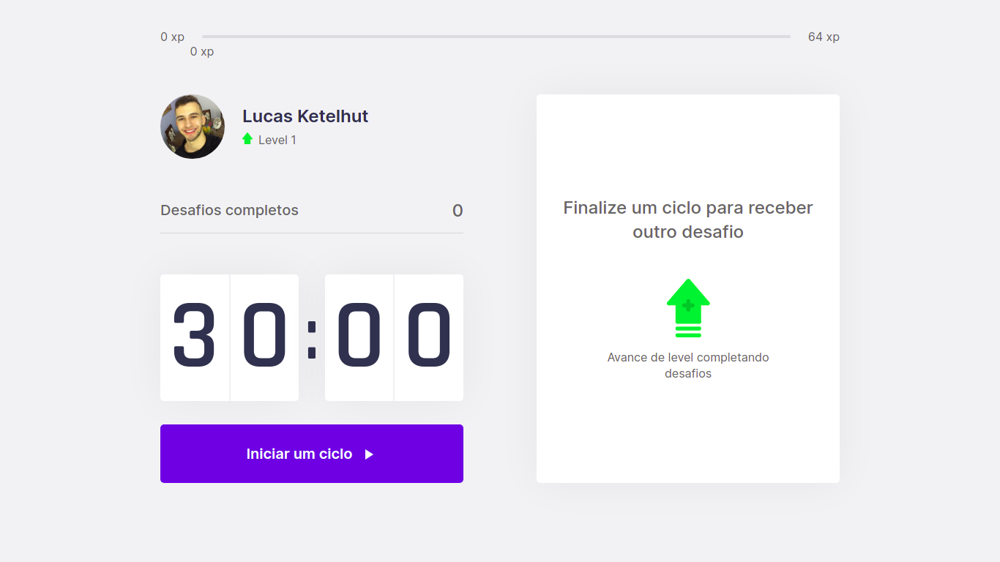

# NLW-4 (Trilha React)
Aplicação desenvolvida durante a quarta edição da Next Level Week, organizada pela Rocketseat. Um evento que dura uma semana toda, voltada pra o desenvolvimento profissional dos participantes, em busca de um próximo nível. As aulas são publicadas todos os dias de segunda a sexta e todo conteúdo é retirado do ar no final do domingo.

Durante o desenvolvimento utilizamos tecnologias como: ReactJS, Next.js e fiz o deploy via Vercel.

# O que eu tirei de aprendizado durante essa semana: 
- Aprendi a importância de utilizar o Next.js para melhorar o SEO de uma aplicação ReactJS.
- Aprendi a utilizar a Context API para fazer com que os componentes criados durante o desenvolvimento possam se relacionar.
- Entendi melhor o conceito de SPA (Single-Page Application) para uma melhor experiência do usuário e consumo de menos recursos no lado do cliente.
- Entendi melhor o uso de hooks como useState e useEffect.
- Aprendi a utilizar APIs próprias da WEB, como exemplo: adicionar notificações na aplicação.
- Aprendi a utilizar cookies para guardar informações de um usuário.
